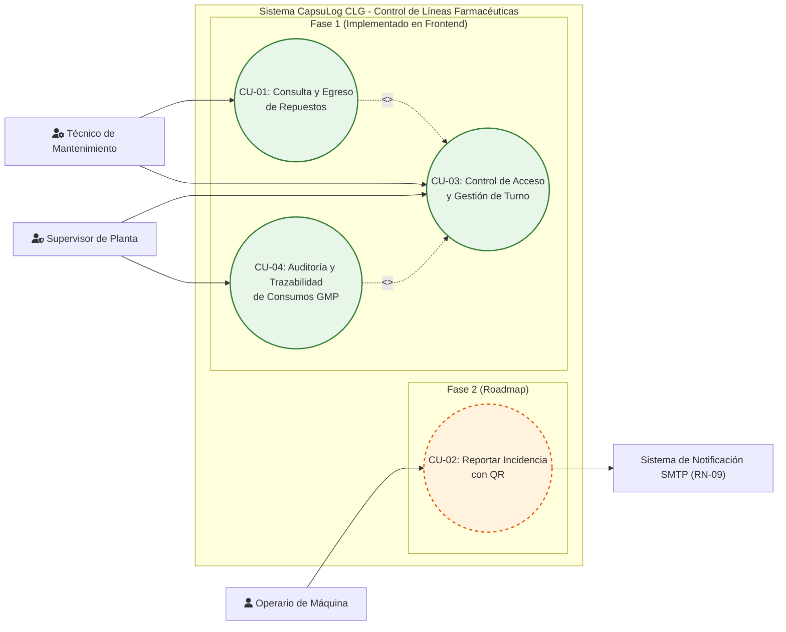

```mermaid
graph LR
    %% Actores
    Operario["fa:fa-user Operario de Máquina"]
    Tecnico["fa:fa-user-cog Técnico de Mantenimiento"]
    Supervisor["fa:fa-user-shield Supervisor de Planta"]
    ServidorNotif["Sistema de Notificación SMTP (RN-09)"]

    %% Frontera del Sistema
    subgraph Sistema_CLG ["Sistema CapsuLog CLG - Control de Líneas Farmacéuticas"]
        
        subgraph Fase1 ["Fase 1 (Implementado en Frontend)"]
            CU03(("CU-03: Control de Acceso<br/>y Gestión de Turno"))
            CU01(("CU-01: Consulta y Egreso<br/>de Repuestos"))
            CU04(("CU-04: Auditoría y Trazabilidad<br/>de Consumos GMP"))
        end

        subgraph Fase2 ["Fase 2 (Roadmap)"]
            CU02(("CU-02: Reportar Incidencia<br/>con QR"))
        end
    end

    %% Relaciones de interacción
    Tecnico --> CU01
    Tecnico --> CU03
    Supervisor --> CU03
    Supervisor --> CU04
    Operario --> CU02

    %% Dependencias del sistema
    CU01 -.->|<<include>>| CU03
    CU04 -.->|<<include>>| CU03
    CU02 -.-> ServidorNotif

    classDef implementado fill:#e8f5e9,stroke:#2e7d32,stroke-width:2px;
    classDef fase2 fill:#fff3e0,stroke:#e65100,stroke-dasharray: 5 5,stroke-width:2px;

    class CU01,CU03,CU04 implementado;
    class CU02 fase2;
```